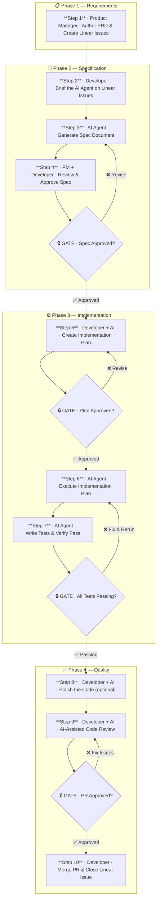

# Spec Driven Development (SDD)

> **AI-Assisted Software Development Workflow** — A structured, specification-first approach that transforms AI from an unpredictable tool into a disciplined collaborator.

---

## What is SDD?

Spec Driven Development (SDD) is a structured workflow that combines human expertise with AI-agent capabilities to deliver software features with greater consistency, clarity, and quality.

Rather than treating AI as a free-form code generator, SDD positions it as a disciplined collaborator — one that reads requirements, reasons about architecture, writes implementation plans, produces code, and validates its own work — all under clear human oversight at every stage.

The workflow integrates three key parties:

- **Product Managers** — articulate what needs to be built
- **Developers** — provide technical direction, review, and approval
- **AI Agents** — accelerate the translation of intent into working software

> **Why SDD works:** Traditional AI-assisted coding often produces misaligned implementations because the AI has no shared understanding of intent. SDD solves this by creating a *contract* — the spec document — that aligns everyone before a single line of code is written.

---

## The Problem SDD Solves

| Challenge | Impact on Delivery |
|---|---|
| Ambiguous requirements | AI interprets vague tickets in unexpected ways, producing code that doesn't match product intent |
| No shared specification | Developers and AI work from different mental models, leading to rework cycles |
| Absent implementation plan | AI jumps straight to code, skipping architectural reasoning and producing fragile solutions |
| Untested code | AI-generated code without a testing step is harder to review and introduces regressions |
| No structured review | Ad hoc review of AI output misses patterns that a structured agent review would catch |
| Lost knowledge | Without spec docs, knowledge lives in chat history and disappears between sessions |

---

## Core Principles

| Principle | Description |
|---|---|
| **Specification First** | No implementation begins without an approved spec document — the single source of truth |
| **Human-in-the-Loop** | Humans set direction, review artefacts, and approve each phase transition. AI executes within those boundaries |
| **Artefacts Over Chat** | Every significant output is saved as a persistent, reviewable artefact. Chat is ephemeral; artefacts are durable |
| **Tests as a Contract** | The AI agent must write tests as part of implementation, and they must pass before the feature is considered done |
| **Incremental Trust** | A spec is reviewed before a plan; a plan is reviewed before code — trust is earned step by step |

---

## Roles & Responsibilities

| Role | Responsibilities |
|---|---|
| **Product Manager** | Authors the PRD. Creates Linear Issues with acceptance criteria. Reviews and approves spec documents. Confirms final implementation meets product intent |
| **Developer** | Drives the AI agent through each phase. Reviews specs, plans, and code. Makes architectural decisions. Approves gate transitions. Raises pull requests |
| **AI Agent (Spec)** | Reads Linear Issues and generates comprehensive spec documents covering requirements, architecture, data models, API contracts, and edge cases |
| **AI Agent (Plan)** | Consumes approved specs and produces a detailed, step-by-step technical implementation plan with file-level context |
| **AI Agent (Implement)** | Executes the approved plan, writes code, writes tests, and verifies all tests pass |
| **AI Agent (Review)** | Performs automated code review on pull requests — bugs, style, security, and deviations from spec |

---

## The Workflow

The SDD workflow is divided into **10 steps** across **4 phases**, with **4 human review gates**.



---

## Step-by-Step Reference

### Phase 1 — Requirements

#### Step 1 · Product Manager · Author the PRD & Create Linear Issues
- Document the feature in a Product Requirements Document (PRD)
- Create corresponding Linear Issues with a clear, user-focused description
- Include measurable acceptance criteria — what does *done* look like?
- Link to relevant designs (Figma, mockups) and related issues
- Note any dependencies, priority, and estimates

---

### Phase 2 — Specification

#### Step 2 · Developer · Brief the AI Agent on Linear Issues
- Open an AI agent session and direct it to read the relevant Linear Issues
- Ask the agent to summarise its understanding before proceeding
- Correct any misunderstandings before moving to Step 3
- Provide additional codebase context the agent needs to read

#### Step 3 · AI Agent · Generate the Spec Document
The spec document covers:
- Feature overview and goals
- Scope — what is included, and explicitly what is **not**
- User stories and acceptance criteria
- System and data architecture changes
- API contracts (endpoints, request/response shapes)
- State management and data flow
- Error handling and edge cases
- Security and permission considerations
- Open questions that need resolution

#### Step 4 · PM + Developer · Review & Approve the Spec
- Does the spec accurately reflect the original Linear Issue intent?
- Are all acceptance criteria addressed?
- Are edge cases and error states covered?
- Are data models and API contracts consistent?
- Run the **Spec-Review Agent** skill for a structured second opinion

> 🔒 **GATE — Spec must be explicitly approved before proceeding**

---

### Phase 3 — Implementation

#### Step 5 · Developer + AI Agent · Create the Technical Implementation Plan
- Ordered list of implementation tasks with file-level specificity
- New files to be created with their intended purpose
- Existing files to be modified and what changes are needed
- Database migrations or schema changes
- New dependencies to be introduced
- Testing strategy — unit, integration, and end-to-end tests

> 🔒 **GATE — Developer reviews and confirms the plan before execution begins**

#### Step 6 · AI Agent · Execute the Implementation Plan
- Work one task at a time; review diffs as they are produced
- Surface ambiguities rather than assuming
- Pause and update the plan if scope needs to change
- Commit logical units of work incrementally rather than one large commit

#### Step 7 · AI Agent · Write Tests & Verify They Pass
- Unit tests for all new functions and methods
- Integration tests for API endpoints and service boundaries
- Tests for each acceptance criterion from the spec
- Negative tests — error states, invalid inputs, permission failures
- All existing tests must continue to pass (no regressions)

> 🔒 **GATE — Zero failing tests before proceeding to the quality phase**

---

### Phase 4 — Quality

#### Step 8 · Developer + AI Agent · Polish the Code *(optional but recommended)*
- **Code Simplifier** — reduces cyclomatic complexity and removes duplication
- **Doc Generator** — produces inline documentation and README updates
- **Performance Advisor** — flags N+1 queries and inefficient patterns
- **Style Enforcer** — applies project-specific style rules consistently

#### Step 9 · Developer + AI Agent · AI-Assisted Code Review
The Code Review Agent checks for:
- Logic errors and potential runtime failures
- Security vulnerabilities — injection, authorisation, data exposure
- Deviation from the approved spec document
- Missing or weak test coverage
- Code style and project convention violations
- Performance concerns — unnecessary queries, blocking operations

The developer resolves all issues identified before merge.

#### Step 10 · Developer · Complete the Linear Issue
- Pull request merged to the main branch
- All automated CI checks passing
- Spec document linked to the Linear Issue
- Implementation notes or decisions documented
- Linear Issue status updated to Done
- Product manager notified for acceptance verification

> ✅ **DONE**

---

## Workflow Summary

| Step | Phase | Driver | Output | Gate |
|:---:|---|---|---|:---:|
| 1 | Requirements | Product Manager | PRD + Linear Issues | |
| 2 | Specification | Developer | Briefed AI Agent | |
| 3 | Specification | AI Agent | Spec Document | |
| 4 | Specification | PM + Developer | Approved Spec | 🔒 |
| 5 | Implementation | Dev + AI Agent | Implementation Plan | 🔒 |
| 6 | Implementation | AI Agent | Working Code | |
| 7 | Implementation | AI Agent | Passing Test Suite | 🔒 |
| 8 | Quality | Dev + AI Agent | Polished Code | |
| 9 | Quality | Dev + AI Agent | Code Review Report | |
| 10 | Quality | Developer | Closed Linear Issue | ✅ |

---

## SDD Artefacts

SDD produces four primary artefacts. Each should be saved, linked to the Linear Issue, and retained for future reference.

| Artefact | Author | Purpose | Storage |
|---|---|---|---|
| **PRD** | Product Manager | Describes the feature from a user and business perspective | Product team docs |
| **Spec Document** | AI Agent (reviewed by PM + Dev) | Translates product intent into a technically precise blueprint | `docs/specs/` in the repo |
| **Implementation Plan** | AI Agent (reviewed by Dev) | Maps the spec to specific code changes | `docs/specs/` alongside the spec |
| **Test Suite** | AI Agent | Documents expected behaviour and guards against regressions | Committed with the code |

---

## AI Agent Skills

| Skill | Used In | Purpose |
|---|---|---|
| **Spec Agent** | Step 3 | Reads Linear Issues and generates comprehensive spec documents |
| **Spec-Review Agent** | Step 4 | Reviews a generated spec for gaps, inconsistencies, and missing edge cases |
| **Plan Mode** | Step 5 | Structured planning mindset — produces an implementation plan rather than jumping to code |
| **Code Simplifier** | Step 8 | Refactors working code to reduce complexity and improve readability |
| **Code Review Agent** | Step 9 | Structured PR review against the spec — bugs, security, coverage, style |

---

## Human Review Gates

There are **four gates** in the SDD workflow. Each requires explicit human approval before proceeding.

```
🔒 Gate 1 — Spec Approval (after Step 4)
   Both the PM and the developer must explicitly approve the spec.
   This is the most critical gate — a bad spec cascades problems through every
   subsequent step. Do not skip or rush this review.

🔒 Gate 2 — Plan Approval (after Step 5)
   The developer reviews the implementation plan for technical correctness,
   completeness, and alignment with the spec. Resolve edge cases here, not
   during coding.

🔒 Gate 3 — Test Passage (after Step 7)
   All tests written by the AI agent must pass before the quality phase begins.
   This is a non-negotiable automated gate — failing tests indicate incomplete
   or incorrect implementation.

🔒 Gate 4 — Pull Request Approval (after Step 9)
   The developer reviews the AI code review report, addresses any issues, and
   obtains human approval of the pull request before merging. The AI review
   supplements but does not replace human code review.
```

---

## Best Practices

### Writing Good Linear Issues
- Always include acceptance criteria — the spec agent needs them to define *done*
- Be explicit about what is **out of scope**
- Link to relevant designs or related issues
- Include known constraints (performance, accessibility, backwards compatibility)

### Getting the Most from Spec Generation
- Brief the agent on relevant codebase context before running the Spec skill
- Ask the agent to confirm its understanding before generating the spec
- Review open questions in the spec and resolve them before plan creation
- Run the Spec-Review skill to catch gaps before human review begins

### Effective Plan Review
- Check that every acceptance criterion from the spec appears in the plan
- Verify that the plan accounts for error states and edge cases
- Challenge any steps that seem to skip necessary complexity
- Ensure the testing strategy is proportionate to the risk of the change

### Managing AI Agent Execution
- Review code incrementally as it is generated, not only at the end
- If the agent deviates from the plan, pause and re-anchor it to the approved plan
- Keep commits small and logically scoped for easier review and rollback
- Do not allow scope creep — out-of-scope changes need a new spec and plan

### Code Review Quality
- Treat the AI code review as a first pass, not a final verdict
- Pay particular attention to security and permission-related findings
- Verify that the review checked behaviour against the spec, not just style
- Always perform a human review in addition to the AI review

---

## Common Pitfalls

| Pitfall | How to Avoid It |
|---|---|
| Skipping the spec review gate | Establish a team norm that no plan may begin without both PM and developer sign-off. Make it visible on the Linear Issue |
| Letting the AI improvise during implementation | If the agent encounters a gap in the plan, pause and update the plan — don't let it make unilateral decisions |
| Treating the spec as a formality | The spec is a working document. If it changes during review, update it before generating the plan |
| Ignoring test failures | Never pass a gate when tests are failing. Investigate and fix root causes rather than suppressing failures |
| Skipping the polish phase | AI-generated code is functional but often verbose. The polish phase pays dividends in maintainability |
| Not linking artefacts to Linear | Spec docs and plans must be linked from the Linear Issue so future developers understand why decisions were made |
| Over-relying on AI code review | The AI review catches patterns; humans catch intent mismatches. It supplements, not replaces, human judgement |

---

## Tooling

| Tool / Platform | Role in SDD |
|---|---|
| **Linear** | Issue tracking and workflow state management — the source of truth for what is being built |
| **AI Agent** | The developer's intelligent assistant across all phases |
| **Spec Agent Skill** | Generates comprehensive spec documents from Linear Issues |
| **Spec-Review Agent Skill** | Reviews and improves spec documents before approval |
| **Plan Mode** | AI agent configuration for structured implementation planning |
| **Code Simplifier Skill** | Post-implementation code quality improvement |
| **Code Review Agent Skill** | Automated PR review against the spec and code quality standards |
| **Git / Version Control** | All artefacts and code are committed. Spec docs live in the repo |

---

## Getting Started

1. **Start with one feature.** Choose a well-defined, medium-sized feature to pilot SDD. Avoid starting with something large or complex.
2. **Ensure Linear Issues are well-formed.** Add acceptance criteria as a required field in your Linear Issue template.
3. **Configure your agent skills.** Set up the Spec Agent, Spec-Review Agent, and Code Review Agent in your AI agent environment.
4. **Run the workflow end-to-end.** Follow all 10 steps in sequence, including all four review gates. Don't skip steps on the first pilot.
5. **Retrospect after the pilot.** Gather feedback from the PM and developer — what worked, what was unclear, what to refine.
6. **Standardise artefact storage.** Agree on where spec docs and plans are stored (e.g., `docs/specs/`) and how they are linked to Linear Issues.
7. **Scale to the team.** Once the pilot is validated, document your team's SDD conventions and roll out to all developers.

---

## Glossary

| Term | Definition |
|---|---|
| **SDD** | Spec Driven Development — the structured AI-assisted development workflow described in this document |
| **PRD** | Product Requirements Document — the PM's description of what is to be built and why |
| **Spec Document** | The AI-generated, human-reviewed specification that precisely defines what will be implemented |
| **Implementation Plan** | The AI-generated, developer-approved step-by-step technical plan for implementing the spec |
| **Agent Skill** | A specialised, pre-configured AI agent workflow designed for a specific task within SDD |
| **Plan Mode** | An AI agent operating mode that prioritises producing structured plans over writing code |
| **Review Gate** | A checkpoint requiring explicit human approval before the workflow can proceed |
| **Linear Issue** | A work item in Linear tracking a feature, bug, or task through the development lifecycle |
| **Artefact** | A persistent, saved output from a workflow step (spec doc, implementation plan, test suite) |

---

*Spec Driven Development transforms AI from an unpredictable tool into a disciplined collaborator — one that amplifies human judgement rather than replacing it.*
